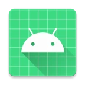

# Emerlink Stream Android



## 📱 О проекте

Emerlink Stream — профессиональное Android-приложение для трансляции видео и аудио с мобильного устройства. Разработано с использованием современных технологий и лучших практик Android-разработки.

## ✨ Основные возможности

### 🎥 Стриминг
- Поддержка протоколов: **RTMP/RTMPs**, **RTSP/RTSPs**, **SRT**, **UDP**
- Настройка параметров видео (разрешение, битрейт, FPS, кодек)
- Поддержка различных видеокодеков: **H.264**, **H.265**, **AV1**
- Настройка параметров аудио (битрейт, частота дискретизации, стерео/моно)
- Поддержка аудиокодеков: **AAC**
- Авторизация для RTMP и RTSP
- Адаптивный битрейт в зависимости от качества соединения

### 📸 Управление камерой
- Переключение между фронтальной и задней камерами
- Управление фонариком
- Зум через жесты
- Автофокус при касании
- Съемка фото во время трансляции

### 📹 Запись
- Запись видео на устройство
- Настройка качества записи
- Одновременная трансляция и запись

### 🔧 Профили подключения
- Создание и редактирование профилей с различными настройками
- Быстрое переключение между профилями
- Полная настройка параметров каждого профиля

## 🏗️ Архитектура

Приложение следует принципам чистой архитектуры и использует:
- **Kotlin** в качестве основного языка программирования
- **Чистую архитектуру** (Clean Architecture)
- **Паттерн репозитория** для работы с данными
- **Koin** для внедрения зависимостей
- **Jetpack Compose** для современного UI
- **Flow/StateFlow** для реактивного программирования
- **Многоуровневую архитектуру MVI** для управления состоянием

## 📂 Структура проекта

Проект организован по функциональным модулям:
- `/app` — основной модуль приложения
- `/presentation` — компоненты пользовательского интерфейса
- `/data` — работа с данными, репозитории
- `/core` — базовые компоненты и утилиты
- `/service` — сервисы для работы с медиа и стримингом

## 📚 Используемые библиотеки

- [RootEncoder](https://github.com/pedroSG94/RootEncoder) — для кодирования видео и аудио
- [Koin](https://insert-koin.io/) — для внедрения зависимостей
- [Jetpack Compose](https://developer.android.com/jetpack/compose) — для создания UI
- [Kotlin Coroutines](https://kotlinlang.org/docs/coroutines-overview.html) — для асинхронного программирования
- [DataStore](https://developer.android.com/topic/libraries/architecture/datastore) — для хранения настроек
- [Navigation Compose](https://developer.android.com/jetpack/compose/navigation) — для навигации в приложении
- [Accompanist](https://google.github.io/accompanist/) — для улучшения работы с Compose

## 📋 Системные требования

- Android 5.0 (API 21) и выше
- Рекомендуется Android 10 (API 29) и выше для использования всех функций
- Устройство с камерой и микрофоном

## 🛠️ Разрешения

Приложение запрашивает следующие разрешения:
- Камера
- Микрофон
- Интернет
- Хранилище (для Android 9 и ниже)
- Уведомления (для Android 13+)
- Фоновые службы для камеры и микрофона (для Android 14+)

## 🚀 Начало работы

1. Клонировать репозиторий
2. Открыть проект в Android Studio
3. Синхронизировать зависимости Gradle
4. Запустить приложение на устройстве или эмуляторе

## 📄 Лицензия

```
Copyright (c) 2024 Emerlink
```
